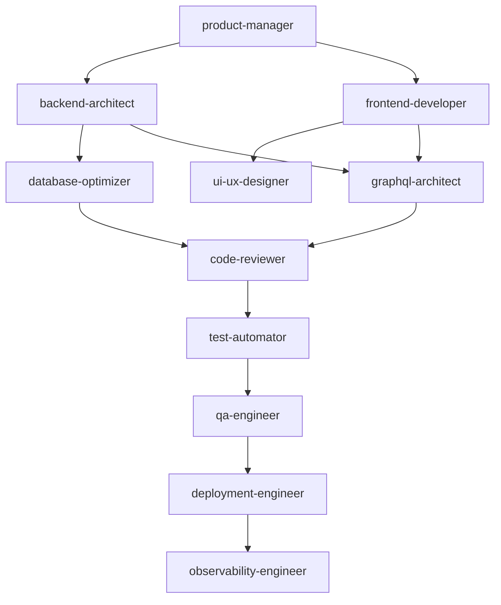
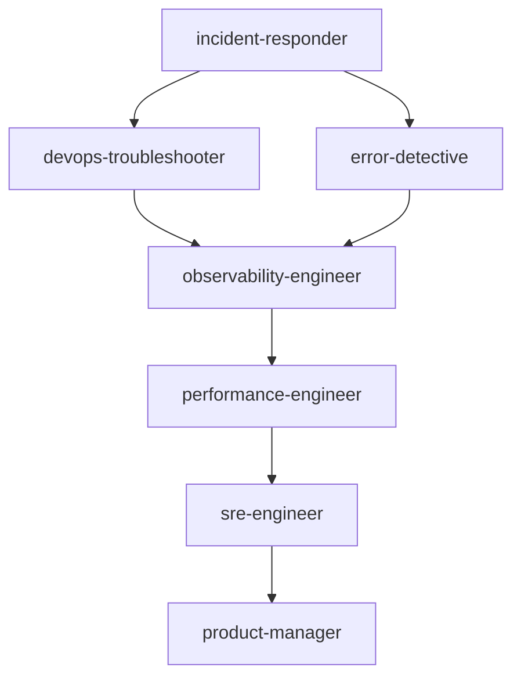
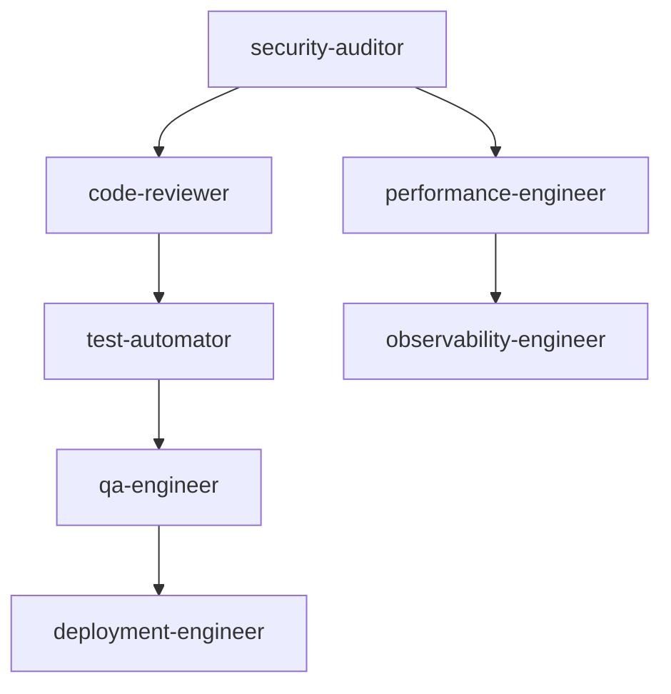

# Agent Dependency Map 🔗

This document maps agent relationships, workflows, and optimal combinations for complex development tasks.

## Agent Relationship Categories

### 🔄 Sequential Workflows
Agents that pass work from one to another in a defined order.

### 🤝 Collaborative Pairs
Agents that work together simultaneously on the same task.

### 🎯 Specialized Teams
Groups of agents optimized for specific project types.

### ⚡ Emergency Response
Critical incident response workflows.

---

## Primary Workflow Patterns

### 1. **Feature Development Lifecycle** 🚀


**Flow**: Product → Architecture → Development → Review → Testing → Deployment → Monitoring

### 2. **Production Incident Response** 🚨


**Flow**: Alert → Debug → Analyze → Fix → Monitor → Learn

### 3. **Security & Compliance Pipeline** 🔒


**Flow**: Security Review → Code Quality → Performance → Testing → Deployment

---

## Agent Collaboration Matrix

### **Development Workflows**

#### **Backend Service Creation**
| Primary Agent | Supporting Agents | Output → Next |
|---------------|-------------------|---------------|
| `product-manager` | `business-analyst` | Requirements → `backend-architect` |
| `backend-architect` | `database-optimizer`, `security-auditor` | Architecture → Language Specialist |
| Language Specialist | `code-reviewer`, `performance-engineer` | Code → `test-automator` |
| `test-automator` | `debugger`, `error-detective` | Tests → `deployment-engineer` |
| `deployment-engineer` | `kubernetes-engineer`, `terraform-specialist` | Deployment → `observability-engineer` |

#### **Frontend Application Development**
| Primary Agent | Supporting Agents | Output → Next |
|---------------|-------------------|---------------|
| `ui-ux-designer` | `product-manager` | Designs → `frontend-developer` |
| `frontend-developer` | `typescript-pro`, `performance-engineer` | Components → `test-automator` |
| `test-automator` | `qa-engineer` | E2E Tests → `code-reviewer` |
| `code-reviewer` | `security-auditor` | Review → `deployment-engineer` |

#### **Mobile App Development**
| Primary Agent | Supporting Agents | Output → Next |
|---------------|-------------------|---------------|
| `mobile-developer` | `ui-ux-designer`, `ios-developer` | App → `test-automator` |
| `test-automator` | `qa-engineer` | Tests → `performance-engineer` |
| `performance-engineer` | `observability-engineer` | Optimization → `deployment-engineer` |

### **Infrastructure Workflows**

#### **Cloud Infrastructure Setup**
| Primary Agent | Supporting Agents | Output → Next |
|---------------|-------------------|---------------|
| `cloud-architect` | `terraform-specialist`, `security-auditor` | IaC → `deployment-engineer` |
| `deployment-engineer` | `kubernetes-engineer`, `network-engineer` | Clusters → `observability-engineer` |
| `observability-engineer` | `sre-engineer` | Monitoring → `platform-engineer` |

#### **Database Migration**
| Primary Agent | Supporting Agents | Output → Next |
|---------------|-------------------|---------------|
| `database-admin` | `database-optimizer`, `legacy-modernizer` | Migration Plan → `sql-pro` |
| `sql-pro` | `performance-engineer` | Optimized Schema → `test-automator` |
| `test-automator` | `devops-troubleshooter` | Tests → `deployment-engineer` |

---

## Specialized Team Formations

### **🎯 Microservices Team**
**Core Members**:
- `backend-architect` (Lead)
- `kubernetes-engineer` 
- `observability-engineer`
- `sre-engineer`

**Support Members**:
- Language Specialists (`golang-pro`, `java-pro`)
- `security-auditor`
- `performance-engineer`

**Workflow**: Architecture → Implementation → Containerization → Monitoring → Reliability

### **🎯 AI/ML Product Team**
**Core Members**:
- `ai-engineer` (Lead)
- `ml-engineer`
- `data-engineer`
- `python-pro`

**Support Members**:
- `backend-architect`
- `performance-engineer`
- `observability-engineer`

**Workflow**: Model → Pipeline → Serving → Monitoring

### **🎯 E-commerce Platform Team**
**Core Members**:
- `payment-integration` (Lead)
- `security-auditor`
- `backend-architect`
- `frontend-developer`

**Support Members**:
- `performance-engineer`
- `database-optimizer`
- `qa-engineer`

**Workflow**: Payment Flow → Security → Performance → Testing

### **🎯 Enterprise Migration Team**
**Core Members**:
- `legacy-modernizer` (Lead)
- `cloud-architect`
- `database-admin`
- `platform-engineer`

**Support Members**:
- `security-auditor`
- `performance-engineer`
- `devops-troubleshooter`

**Workflow**: Assessment → Planning → Migration → Validation

---

## Agent Compatibility Matrix

### **High Synergy Pairs** ⭐⭐⭐
| Agent A | Agent B | Synergy Reason |
|---------|---------|----------------|
| `backend-architect` | `database-optimizer` | Schema design + query optimization |
| `frontend-developer` | `ui-ux-designer` | Implementation + design alignment |
| `security-auditor` | `code-reviewer` | Security + quality assurance |
| `observability-engineer` | `sre-engineer` | Monitoring + reliability practices |
| `platform-engineer` | `kubernetes-engineer` | Developer platforms + container orchestration |
| `ai-engineer` | `ml-engineer` | LLM applications + ML pipelines |
| `devops-troubleshooter` | `incident-responder` | Debugging + crisis management |
| `payment-integration` | `security-auditor` | Financial compliance + security |

### **Moderate Synergy Pairs** ⭐⭐
| Agent A | Agent B | Synergy Reason |
|---------|---------|----------------|
| `product-manager` | `business-analyst` | Requirements + metrics |
| `test-automator` | `qa-engineer` | Automated + manual testing |
| `performance-engineer` | Language Specialists | Optimization + implementation |
| `deployment-engineer` | `cloud-architect` | Deployment + infrastructure |
| `data-engineer` | `database-admin` | Data pipelines + database ops |

### **Potential Conflicts** ⚠️
| Agent A | Agent B | Conflict Reason | Resolution |
|---------|---------|-----------------|------------|
| `legacy-modernizer` | `performance-engineer` | Competing priorities (compatibility vs speed) | Sequential: modernize → optimize |
| `rapid-developer` | `security-auditor` | Speed vs thoroughness | Review checkpoints |
| `ai-engineer` | `performance-engineer` | Model accuracy vs latency | Define SLAs upfront |

---

## Workflow Templates

### **Template 1: New Feature Development**
```yaml
name: "Feature Development Pipeline"
trigger: "New feature request"
agents:
  planning:
    - agent: product-manager
      role: requirements
      outputs: [user-stories, acceptance-criteria]
  
  architecture:
    - agent: backend-architect
      role: system-design
      inputs: [user-stories]
      outputs: [api-spec, architecture-diagram]
    - agent: ui-ux-designer
      role: interface-design
      inputs: [user-stories]
      outputs: [wireframes, design-system]
  
  development:
    - agent: backend-specialist
      role: implementation
      inputs: [api-spec]
      outputs: [backend-code]
    - agent: frontend-developer
      role: implementation
      inputs: [wireframes, api-spec]
      outputs: [frontend-code]
  
  quality:
    - agent: code-reviewer
      role: review
      inputs: [backend-code, frontend-code]
      outputs: [review-feedback]
    - agent: test-automator
      role: testing
      inputs: [backend-code, frontend-code]
      outputs: [test-suite]
  
  deployment:
    - agent: deployment-engineer
      role: release
      inputs: [reviewed-code, test-suite]
      outputs: [deployed-feature]
  
  monitoring:
    - agent: observability-engineer
      role: monitoring
      inputs: [deployed-feature]
      outputs: [dashboards, alerts]
```

### **Template 2: Performance Optimization**
```yaml
name: "Performance Optimization Pipeline"
trigger: "Performance issues detected"
agents:
  analysis:
    - agent: performance-engineer
      role: profiling
      outputs: [bottleneck-analysis]
    - agent: observability-engineer
      role: metrics-analysis
      outputs: [performance-metrics]
  
  optimization:
    - agent: database-optimizer
      role: query-optimization
      inputs: [bottleneck-analysis]
      condition: database-bottlenecks
    - agent: backend-architect
      role: architecture-review
      inputs: [bottleneck-analysis]
      condition: system-bottlenecks
  
  validation:
    - agent: test-automator
      role: load-testing
      inputs: [optimized-code]
    - agent: performance-engineer
      role: validation
      inputs: [load-test-results]
```

### **Template 3: Security Review**
```yaml
name: "Security Review Pipeline"
trigger: "Security audit required"
agents:
  audit:
    - agent: security-auditor
      role: vulnerability-scan
      outputs: [security-report]
  
  remediation:
    - agent: code-reviewer
      role: secure-coding-review
      inputs: [security-report]
    - agent: backend-architect
      role: architecture-security-review
      inputs: [security-report]
  
  validation:
    - agent: test-automator
      role: security-testing
      inputs: [remediated-code]
    - agent: security-auditor
      role: final-audit
      inputs: [test-results]
```

---

## Agent Communication Patterns

### **Information Flow Types**

#### **🔀 Parallel Processing**
Multiple agents work simultaneously on different aspects:
- `backend-architect` + `frontend-developer` + `database-optimizer`
- `security-auditor` + `performance-engineer` + `code-reviewer`

#### **📋 Sequential Processing** 
Agents work in defined order, each building on previous work:
- `product-manager` → `backend-architect` → Language Specialist → `code-reviewer`

#### **🔄 Iterative Refinement**
Agents cycle through improvements:
- `code-reviewer` ↔ `debugger` ↔ `test-automator`

#### **📊 Advisory Consultation**
Specialist agents provide input to primary agents:
- `security-auditor` advises `backend-architect`
- `performance-engineer` advises Language Specialists

---

## Usage Recommendations

### **For Simple Tasks** 
Use 1-3 agents in sequence:
- Bug Fix: `debugger` → `code-reviewer` → `test-automator`
- Documentation: `technical-writer` → `code-reviewer`

### **For Medium Tasks**
Use 3-5 agents with some parallelism:
- API Development: `backend-architect` → `golang-pro` + `database-optimizer` → `test-automator` → `deployment-engineer`

### **For Complex Projects**
Use specialized teams of 5-8 agents:
- Full-stack feature with multiple workflows running in parallel

### **For Crisis Situations**
Use emergency response patterns:
- Production issue: `incident-responder` → `devops-troubleshooter` + `observability-engineer` → `sre-engineer`

---

## Success Metrics

### **Workflow Efficiency**
- Time from requirement to deployment
- Number of iterations required
- Agent handoff success rate

### **Quality Outcomes**
- Defect detection rate by agent combinations
- Performance improvement metrics
- Security vulnerability prevention

### **Agent Utilization**
- Most frequently used agent combinations
- Agent idle time in workflows
- Bottleneck agent identification

---

*This dependency map enables intelligent agent orchestration, workflow optimization, and automated agent recommendation for the catalog system.*